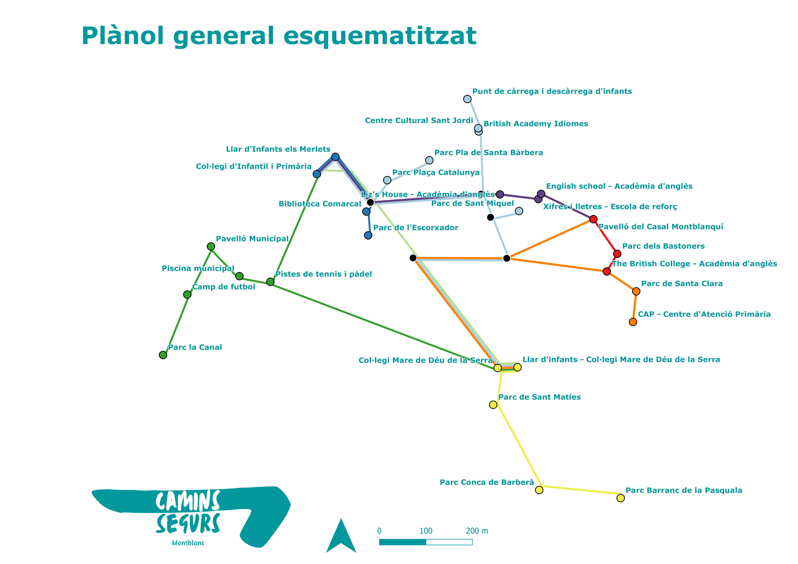

# LECTURA DE TEST
A test repository for publishing my first web page. This website is published at [Test.io](https://edumolne.github.io/test/)

Canvi

## 1 Tema/motivació.
*Explica l’ **objectiu** de la web i la motivació per fer-la. Vinculació
amb Geografia.*
Camins Segurs és un projecte fictici creat a l’assignatura de Producció, disseny cartogràfic i eines web del grau en Geografia, Anàlisi territorial i Sostenibilitat de la Universitat Rovira i Virgili.

Aquest projecte té dues finalitats:

1a. La creació d’una pàgina web. La primera de les finalitats és crear una pàgina web amb els codis html (HyperText Markup Language), ccs (Cascading Style Sheets) i js (Java Script) treballats a l'assignatura i l'incorporació d'un mapa a la mateixa pàgina web.

2a. Exposició pública dels diferents Camins Segurs. Els visitants de la pàgina web podran conèixer els diferents recorreguts que connecten els centres educatius de Montblanc amb els equipaments esportius, culturals i altres centres formatius on els nens i les nenes duen a terme les seves activitats extraescolars. Amb l’objectiu de crear recorreguts on coincideixin amb altres nens i nenes, es redueixi l’ús dels vehicles privats, s’introdueixin al món de l’orientació i utilitzin camins millor condicionats.

## 2 Dades/continguts.
*Imatges de referència de la pàgina web*

***Figura 1.** Logotip del projecte. L'he utilitzat a la capçalera.*

***Figura 2.** Logotip del projecte amb el fons blanc. L'he utilitzat a la capçalera quan es passa el cursor per sobre.*

***Figura 3.** Logotip del projecte amb el fons negre. L'he utilitzat al peu de pàgina.*

***Figura 4.** Logotip del projecte amb lletra negre. No se li ha donat cap utilitat però és una imatge més de suport si fos necessari.*

***Figura 5.** Logotip d'un dels camins. Aquesta imatge apareix al menú d'accés als camins segurs.*

***Figura 6.** Logotip d'un dels camins amb el fons blanc. Aquesta imatge s'utilitza quan s'ha obert aquella ruta.*

***Figura 7.** Logotip d'un dels camins amb el fons negre. Aquesta imatge s'utilitza quan passa el cursor per sobre de cada opció.*

***Figura 8.** Plànol general de totes les rutes de forma esquematitzada.*

D’on s’han tret les:
- Les dades han estat extretes de fons com l'Institut Cartogràfic de Catalunya i les ortofotografies i les capes .shp de l'Institut Cartogràfic i Geològic de Catalunya.
- El text ha estat d'elaboració pròpia (Eduard Molné Pulido, març del 2023)
- Els logotips han estat d'elaboració pròpia amb el programari Canva.
- La pàgina web ha tingut tres fases. Fase inicial, elaborada en un bloc de notes. Fase intermitja, elaborada en Visual Studio Code. I la fase final, des de la plataforma digital GitHub.

## 3 Estructura de la Web.
*Seccions, decisions preses en la presentació dels apartats, s’han utilitzat els elements adequats per representar la informació*
La pàgina té una estructura de:
- **Capçalera** on es troba el menú amb l'accessibilitat als diferents apartats (Els camins segurs/Què és?/Montblanc)
- **Portada** es troba la següent imatge:

***Figura 9.** Portada de la pàgina web de Camins Segurs.*

- **Els Camins segurs.** Hi ha un menú amb les diferents rutes possibles d'accessibilitat segura als col·legis i espais d'ús d'infants. I el mapa general. (En el cas de cada ruta escollida el mapa està apliat a aquesta).
- **Què és?** Hi ha una breu descripció dels objectius i el funcionament de la pàgina web.
- **Montblanc.** S'hi troba un recull molt petit d'informació rellevant sobre Montblanc.
- **Altres logotips**. On hi ha un recull dels logotips elaborats per la pàgina web.
- **Peu de pàgina**. Hi ha el logotip del projecte i de l'institució que l'impulsat (Universitat Rovira i Virgili, Departament de Geografia). També, un menú per retornar a un dels apartats, l'inici (que et porta a la capçalera de la pàgina inicial, índex.html) i tornar a la capçalera de la pàgina on es trobi en aquell moment.

La pàgina *índex.html* ha estat clonada vuit vegades, una per cada ruta i amb petits canvis:
- Primera diferència: El mapa es troba ampliat per cada ruta.
- L'imatge de la ruta es troba amb el fons blanc.
- Al peu de l'imatge hi ha una nota informativa de la pàgina on es troba.

## 4 Web responsive.
*Explica cóm ha fet (alguna tècnica) per a que la seva web
s’adapti a diferents dispositius. Resolució de les imatges, etc*
Aquesta pàgina web té dues adaptacions del menú de la capçalera:
- Per ordinador (pantalla major a 580px). El menú es troba amb totes les opcions visibles.
- Per mòbil (pantalla menor a 580px). El menú es troba ocultat i es deplaga quan es prem la caixeta del menú.

L'imatge de portada s'adapta, sempre, al 100% de la pantalla, sigui quin sigui la seva mida.

Els botons de cada camí segur ocupa el 25% de la pantalla (quan aquesta sigui superior a 580px) o el 50% (quan aquesta sigui inferior a 580px)

El mapa ocupa el 85% de la pantalla (d'aquesta manera s'adapta sempre a la mida de la pantalla) i queda un 15% per desplaçar la pàgina quan aquesta es visualitzi des d'un telèfon mòbil.

El peu de pàgina els logotips ocupen el 60% de l'amplada de la pantalla i el menú el 40% (quan la pantalla és superior a 580px) o el 100% cada "caixeta" (quan la pantalla és inferior a 580px).

## 5 Cartografia.
*Com s’han integrat i elaborat els mapes que apareixen a la web.*
La pàgina web té un sol mapa creat amb nou ampliaciona automàtiques diferents, una per cada possible ruta i una de general a la pàgina incial, però que l'usuari pot adaptar-la. El mapa té limitacions per, només, poder visualitzar el municipi de Montblanc i no poder-la ampliar fins a mides que no es reconeixen els elements.

El mapa ocupa el 85% de la pantalla (d'aquesta manera s'adapta sempre a la mida de la pantalla) i queda un 15% per desplaçar la pàgina quan aquesta es visualitzi des d'un telèfon mòbil.

## 6 Dificultats/millores.
*Reflexiona proactivament sobre el producte elaborat*.
El mapa final que per mòbil tingui l'amplada del 85% (com ara) per poder visualitzar des d'un telèfon mòbil i per ordinador del 100%.

## 7 Pregunta.
Respon a les preguntes de manera adient i utilitza el vocabulari tècnic
necessari.

## 8 Readme ##
This README would normally document whatever steps are necessary to get your application up and running.

#### What is this repository for? ####

* Quick summary
* Version
* [Learn Markdown](https://bitbucket.org/tutorials/markdowndemo)

#### How do I get set up? ####

* Summary of set up
* Configuration
* Dependencies
* Database configuration
* How to run tests
* Deployment instructions

#### Contribution guidelines ####

* Writing tests
* Code review
* Other guidelines

#### Who do I talk to? ####

* Repo owner or admin
* Other community or team contact

